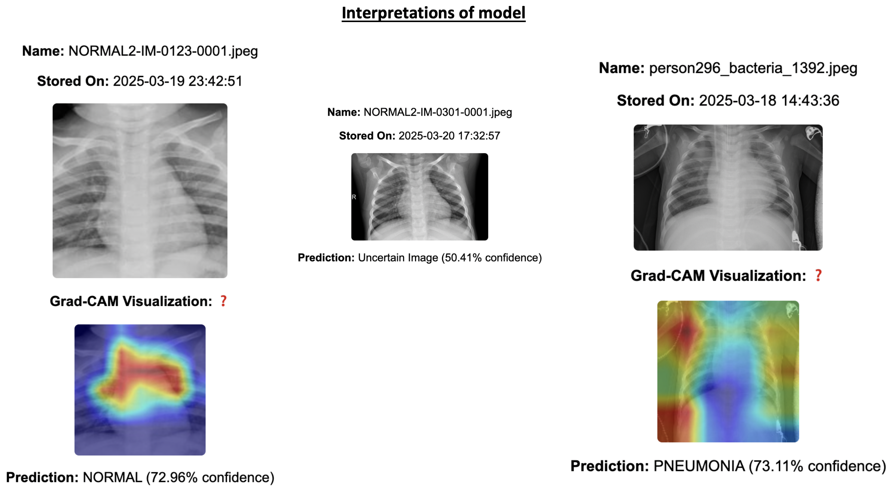
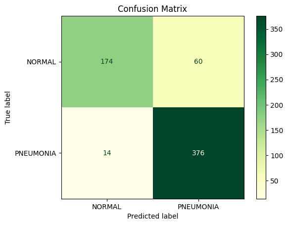
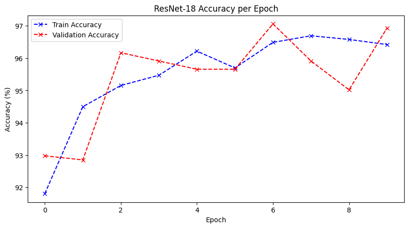
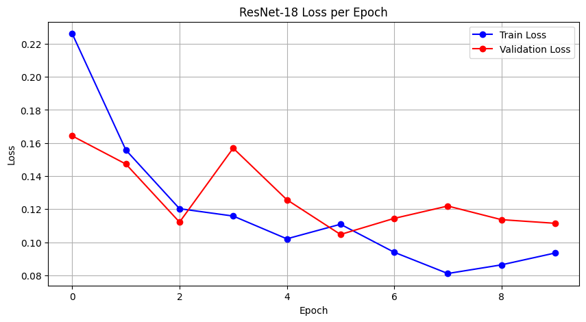

# Pneumonia Classification with Deep Learning

A deep learning web application that classifies chest X-rays as **Normal** or **Pneumonia**. With an **Uncertain** fallback when the model's confidence is low and visualizes the model's attention using **Grad-CAM** heatmaps.

## Overview

- **Transfer learning** with a **frozen ResNet-18** (ImageNet) backbone plus a custom classifier head. Only the head is trained, the convolutional backbone is used as a fixed feature extractor (i.e. feature extraction, *not* full fine tuning).
- **Flask** inference server (`pneumonia_api.py`) supporting single or batch image upload (PNG/JPG/JPEG/DICOM).
- **Grad-CAM** heatmaps highlight the image regions driving each prediction.
- **Batch management:** save, browse, and delete named sets of predictions.

## Demo

A prediction with its confidence score and a Grad-CAM heatmap highlighting the regions that drove the decision:



## Model

| | |
|---|---|
| Backbone | ResNet-18, ImageNet weights, **frozen** |
| Classifier head | `Linear(512→128) → BN → ReLU → Linear(128→32) → BN → ReLU → Linear(32→2)` |
| Input | 224×224, grayscale converted to 3 channel, ImageNet normalised |
| Loss / optimizer | CrossEntropyLoss, Adam (lr = 1e-3) |
| Epochs | 10 |

## Dataset

- **Source:** Kermany et al. (2018), *Chest X-Ray Images (Pneumonia)* Mendeley Data, v3: https://data.mendeley.com/datasets/rscbjbr9sj/3
- **Splits (as used here):**
  - Train / Validation: 5,212 images (1,339 Normal / 3,873 Pneumonia), split 85/15 (stratified, seeded) → ~4,430 train / ~782 validation
  - Test: 624 images (234 Normal / 390 Pneumonia)
- **Preprocessing:** resize to 224×224, grayscale→RGB, ImageNet normalization; random horizontal flip and small rotation augmentation on the training split only.

## Setup

```bash
python -m venv venv
source venv/bin/activate          # Windows: venv\Scripts\activate
pip install -r requirements.txt        # run the app only
pip install -r requirements-dev.txt    # also train / run tests (includes the above)
```

Place the dataset under `chest_xray/` with `train/` and `test/` folders, each containing `NORMAL/` and `PNEUMONIA/` subfolders. The validation set is split from `train/` automatically.

## Train  (produces `model.pth`)

Training lives in `New.ipynb`. Open it (`jupyter lab New.ipynb`) and run all cells, or execute it headless:

```bash
jupyter nbconvert --to notebook --execute New.ipynb
```

This saves the trained weights to `model.pth` in the project root.

> Update the dataset path at the top of the notebook to point at your local `chest_xray/` directory before running.

## Run the app

```bash
python pneumonia_api.py
```

Then open http://localhost:5000.

### UI controls
- Upload one or more X-rays on the main page to get predictions, confidence scores, and Grad-CAM overlays.
- Save a set of results into a named batch (folder).
- Browse saved batches at `/view_batches`.

## Tests

```bash
pip install -r requirements-dev.txt
pytest
```

## Docker

```bash
docker build -t pneumonia-app .
docker run -p 5000:5000 pneumonia-app
```

Then open http://localhost:5000. The image bundles `model.pth`, so rebuild it after retraining.

## Project structure

```
├── New.ipynb              # Model training (data loading → train → evaluate → save model.pth)
├── pneumonia_api.py       # Flask server + inference + Grad-CAM
├── model.pth              # Trained ResNet-18 weights (not committed — see note)
├── requirements.txt       # App runtime dependencies
├── requirements-dev.txt   # + training & test dependencies
├── Dockerfile             # Containerized app (gunicorn)
├── Procfile               # gunicorn entry point for deployment
├── tests/                 # pytest suite
├── templates/             # index.html, view_batches.html, view_tests.html
├── static/
│   ├── uploads/           # Uploaded original X-rays
│   ├── heatmaps/          # Grad-CAM overlays
│   └── batches/           # Saved result folders
└── chest_xray/            # Dataset (not committed)
```

## Results

Evaluated on the held out 624 image test set, using the best model by validation loss:

| Class | Precision | Recall | F1 |
|---|---|---|---|
| Normal | 0.93 | 0.74 | 0.82 |
| Pneumonia | 0.86 | 0.96 | 0.91 |

- **Overall accuracy:** 0.88
- **Balanced accuracy:** 0.85



174/234 normal and 376/390 pneumonia correct. The model leans toward predicting pneumonia (60 false positives vs only 14 missed cases)




Graph shows accuracy increasing per epoch




Graph shows loss decreasing per epoch


## Interpretability Grad-CAM

Each prediction includes a Grad-CAM heatmap computed from ResNet-18's last convolutional block, overlaid on the original X-ray to show which regions most influenced the decision.

## Future work

- Incorporate deeper architectures like **DenseNet**
- Extend to multi-class (e.g. add COVID-19).
- Deploy to a cloud host for public access
